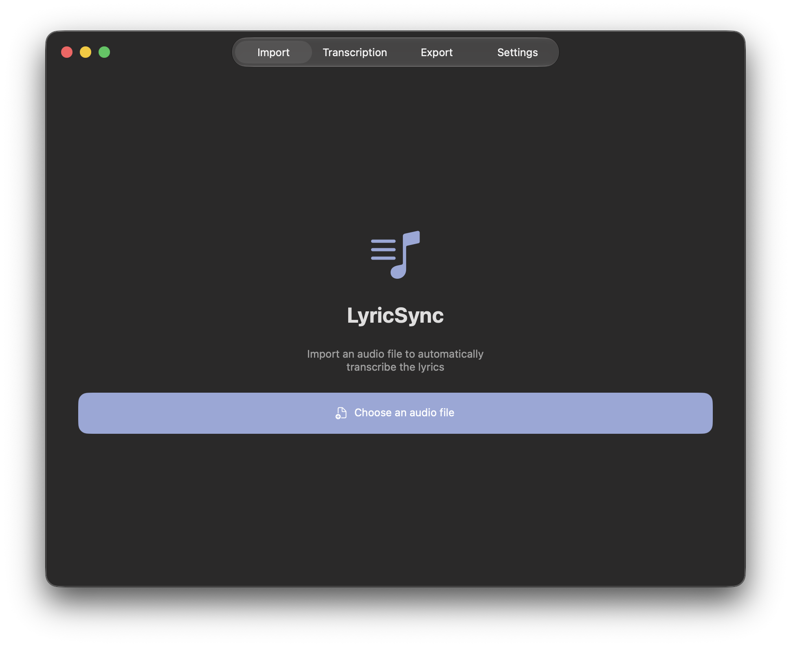
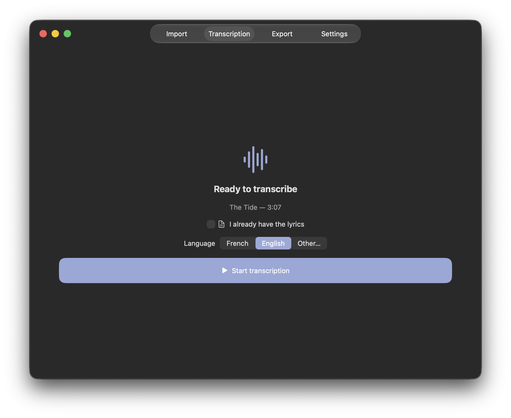
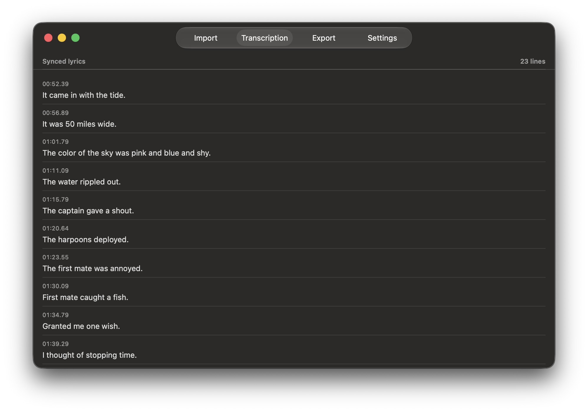
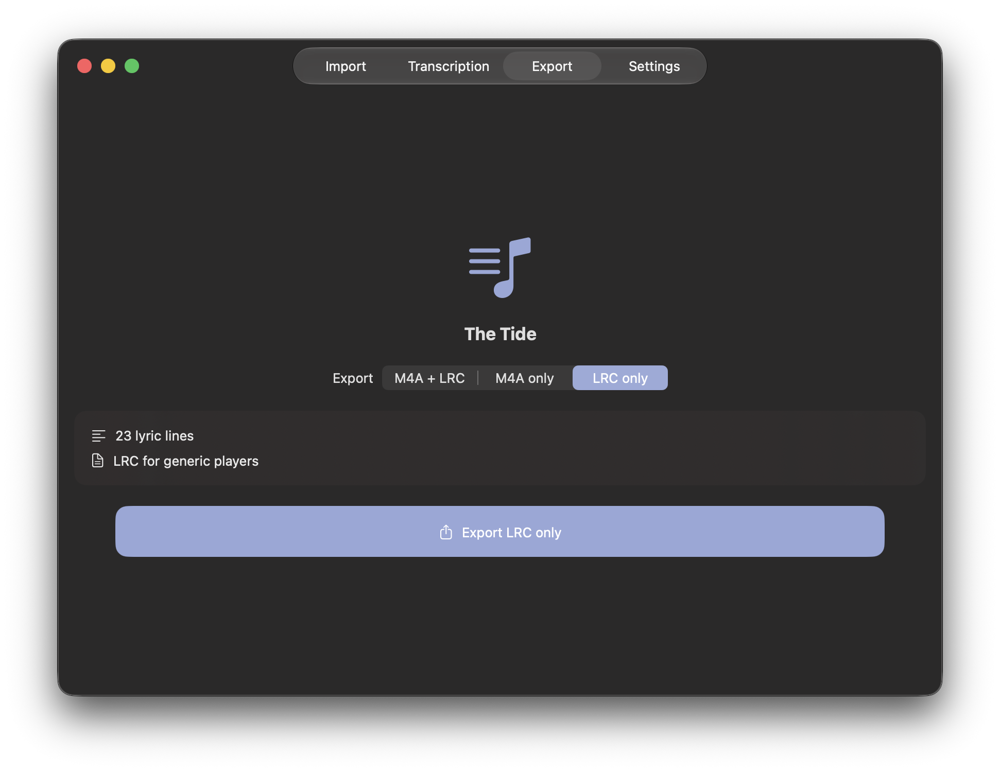
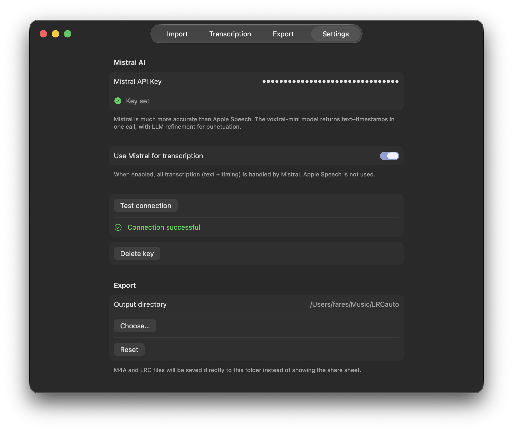

# LyricSync

  

**iOS/Mac app that transcribes and/or syncs lyrics from any audio file, using Apple Speech or Mistral AI.**

Import a song, get lyrics with timestamps, and export ready-to-use files for any media player supporting LRC.

## Features

- **Import any audio file** — M4A, MP3, WAV, AIFF
- **Transcription** — On-device (Apple Speech) or Mistral AI Voxtral
- **Smart punctuation** — Mistral LLM perfects punctuation and line breaks where natural
- **Paste existing lyrics** — You can also paste your own text (one verse per line) to sync it.
- **Export M4A** with embedded lyrics, sideloadable to the iOS Music app (but NOT synced as Apple refuses to display any synced lyrics for non-AppleMusic songs).
- **Export LRC** *(Universal text file format for timestamped lyrics)* for any media player that supports them.
- **Edit lyrics** after transcription — fix any mistakes inline
- **Low‑confidence warnings** — spots words the model isn't sure about

## Requirements

- iOS 17+ or macOS 14+
- Optional but HIGHLY recommended : Mistral AI API key for FAR BETTER transcription. (It's free! You'll never reach the API limit for that use case).

## Install

Download the latest release:

- **iOS**: `LyricSync.ipa` — sideload with AltStore, SideStore, or similar *(LiveContainer NOT supported yet as I can't let the app access the audio files inside of LC)*
- **macOS**: `LyricSync.app` — unzip and drag to Applications

> Speech recognition requires a physical device — not available in the iOS simulator.

<b>Screenshots</b>

  
  
  
  
  

